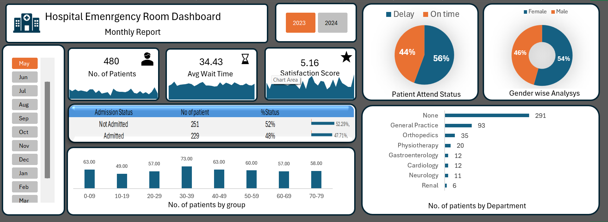

# 🏥 Hospital Emergency Room Dashboard

## 📊 Overview
This project is an interactive Excel dashboard built to analyze hospital emergency room data.

## 🚀 Features
- Total patients tracking
- Average wait time analysis
- Patient satisfaction score
- Admission vs non-admission
- Age group insights
- Department referrals

## 🛠 Tools Used
- Microsoft Excel
- Pivot Tables
- Charts
- Slicers

## 📸 Dashboard Preview

## 📂 Files
- Excel Dashboard (.xlsx)
- Dashboard Image

## ▶️ Demo
Coming soon
